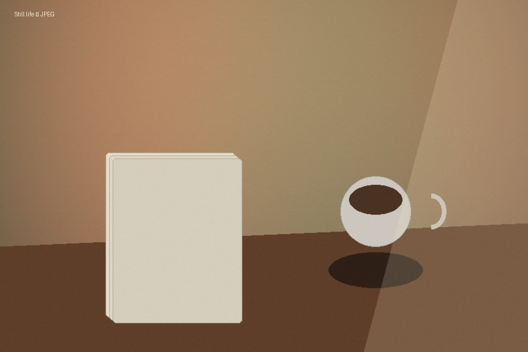

# C07 — Quarterly service review

## Summary

The service processed 1,284 page updates this quarter. The main risk is
attachment sizing: a structurally valid page can still be hard to read.

| Measure | Current | Previous | Interpretation |
| :--- | ---: | ---: | :--- |
| Pages updated | 1,284 | 1,106 | Existing page IDs were reused. |
| Attachments uploaded | 317 | 221 | Diagrams and screenshots account for most of the increase. |
| Pages needing review | 24 | 39 | Remaining failures involve wide tables or image display size. |

## Architecture

The pipeline diagram should be as readable here as in C04, despite sitting
between prose and another table.


The photo is supporting evidence, but should still use the available width
rather than becoming a thumbnail.



## Incident sample

| Page | Symptom | Mechanism | Next check |
| :--- | :--- | :--- | :--- |
| `OPS-142` | The table became eight equal narrow columns. | No table or cell width was emitted. | Inspect the final rendered table geometry. |
| `ENG-207` | The image looked like a thumbnail. | The media node had no display size. | Compare displayed and intrinsic dimensions. |
| `DOC-031` | A local SVG did not appear. | Upload or SVG handling failed. | Inspect the media response and rendered page. |

## Example request

```json
{"pageId":"782134","version":13,"status":"current"}
```

The closing paragraph should follow the code block without adopting the
table's width or the figure's alignment.
