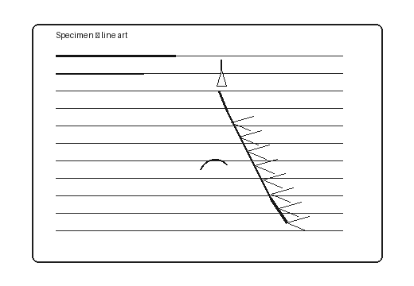

# C03 — Raster media

## Landscape photo

The 900×600 photo is the main figure. It should occupy a substantial part of
the available reading width on desktop, fit on a narrower browser, and keep
the same 3:2 aspect ratio. It should not appear as a small icon.

The paragraph after the photo checks that text returns to the usual width.

## Labeled line art

This 520×360 PNG contains fine lines. The labels must be readable at the
rendered size; enlarging it beyond its useful resolution would also be poor.

The two figures should remain in source order and retain their alt text.
