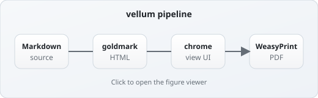
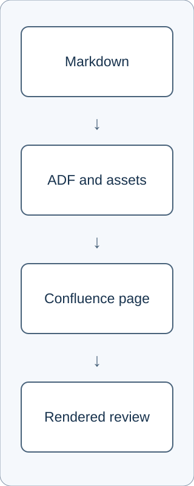
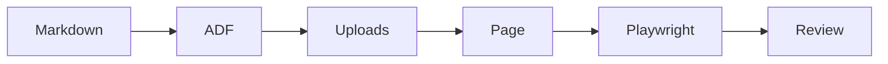

# C04 — Vector figures and Mermaid

## Wide diagram

This 520×160 SVG is text-heavy. A tiny centered rendering makes its labels
useless. It should be wide enough to read while retaining its 13:4 ratio.

## Tall diagram

This 320×800 SVG should fit within the visible page width without being
stretched into a wide banner or clipped vertically.

## Small badge

This 64×64 mark should stay small. A blanket “make every image full width”
rule would fail this control.

## Mermaid macro

The source should render through the selected Confluence Mermaid macro. If
that macro is unavailable, the page must show an explicit, readable fallback
rather than a blank box.

