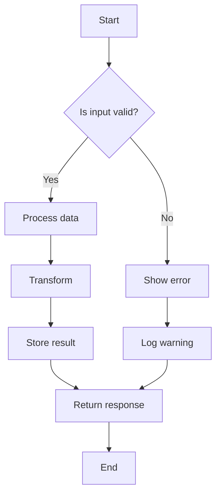
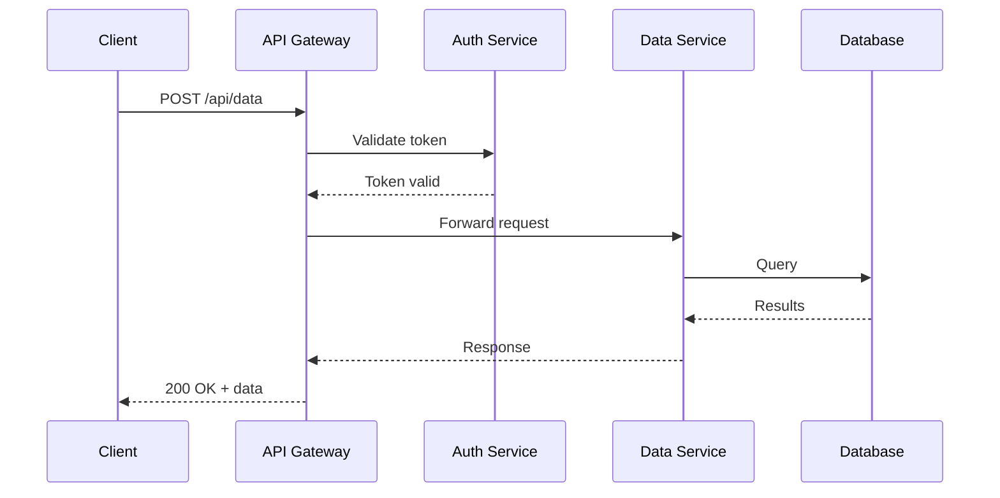
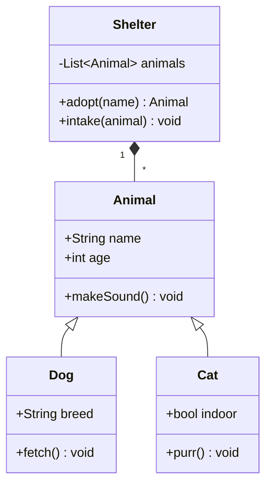
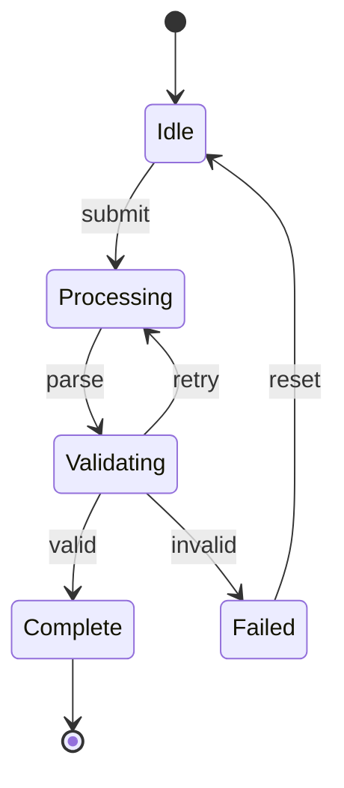
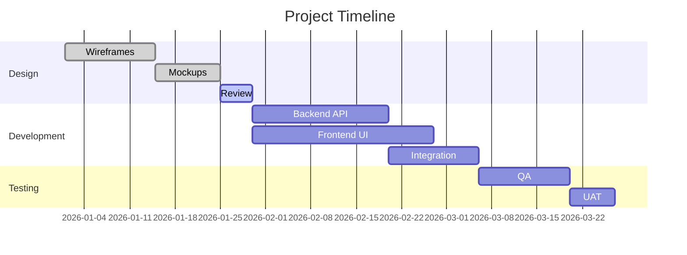
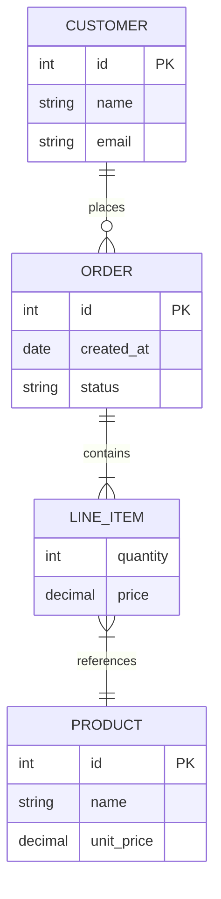
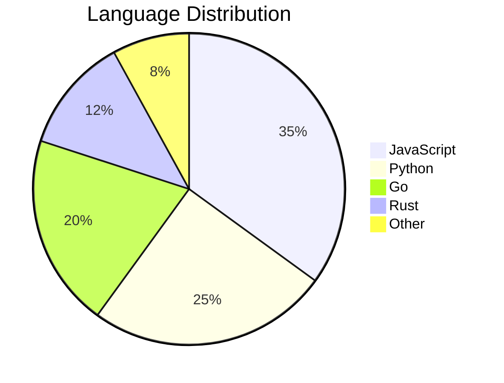

# mpe2pdf Feature Showcase

This document exercises every rendering feature supported by mpe2pdf to serve
as a visual regression test.

## Text Formatting

Regular paragraph text with **bold**, *italic*, ***bold italic***,
~~strikethrough~~, `inline code`, and [links](https://example.com).

Adjacent lines in a paragraph should reflow
into a single block of text without
inserting line breaks between them.

> Blockquotes can contain **formatted text** and even
> multiple paragraphs.
>
> Like this second paragraph.

---

## Headings

### Third Level

#### Fourth Level

##### Fifth Level

###### Sixth Level

## Lists

### Unordered

- Item one
- Item two
  - Nested item A
  - Nested item B
    - Deeply nested
- Item three

### Ordered

1. First step
2. Second step
   1. Sub-step A
   2. Sub-step B
3. Third step

### Task Lists

- [x] Completed task
- [ ] Incomplete task
- [x] Another done item
- [ ] Still pending

### Definition Lists

Term 1
:   Definition for term 1

Term 2
:   Definition for term 2, which can be
    quite long and span multiple lines.

## Tables

### Simple Table

| Feature | Status | Notes |
|---------|--------|-------|
| GFM tables | Supported | Standard pipe syntax |
| Alignment | Supported | Left, center, right |
| Footnotes | Supported | See below |

### Aligned Columns

| Left | Center | Right | Default |
|:-----|:------:|------:|---------|
| L1 | C1 | R1 | D1 |
| L2 | C2 | R2 | D2 |
| L3 | C3 | R3 | D3 |

### Wide Table

| Column A | Column B | Column C | Column D | Column E | Column F |
|----------|----------|----------|----------|----------|----------|
| Data spanning many columns to test table layout and potential overflow behaviour | Short | Medium length cell | Another cell | More data | Final |
| Row 2A | Row 2B | Row 2C | Row 2D | Row 2E | Row 2F |

## Code Blocks

### JavaScript

```javascript
class EventEmitter {
  #listeners = new Map();

  on(event, callback) {
    if (!this.#listeners.has(event)) {
      this.#listeners.set(event, new Set());
    }
    this.#listeners.get(event).add(callback);
    return () => this.off(event, callback);
  }

  emit(event, ...args) {
    for (const cb of this.#listeners.get(event) ?? []) {
      cb(...args);
    }
  }
}
```

### Python

```python
from dataclasses import dataclass, field
from typing import Protocol

class Comparable(Protocol):
    def __lt__(self, other: "Comparable") -> bool: ...

@dataclass(order=True)
class PriorityItem:
    priority: int
    item: str = field(compare=False)

def top_k(items: list[PriorityItem], k: int) -> list[PriorityItem]:
    """Return the k highest-priority items."""
    return sorted(items, reverse=True)[:k]
```

### Go

```go
package main

import (
	"context"
	"fmt"
	"sync"
)

func fanOut[T any](ctx context.Context, in <-chan T, n int) []<-chan T {
	outs := make([]chan T, n)
	for i := range outs {
		outs[i] = make(chan T)
	}
	var wg sync.WaitGroup
	wg.Add(1)
	go func() {
		defer wg.Done()
		i := 0
		for v := range in {
			select {
			case outs[i%n] <- v:
				i++
			case <-ctx.Done():
				return
			}
		}
	}()
	// Convert to read-only channels
	result := make([]<-chan T, n)
	for i, ch := range outs {
		result[i] = ch
	}
	return result
}
```

### Rust

```rust
use std::collections::HashMap;

trait Summarise {
    fn summary(&self) -> String;
}

struct Article {
    title: String,
    author: String,
    content: String,
}

impl Summarise for Article {
    fn summary(&self) -> String {
        format!("{} by {} — {}...", self.title, self.author, &self.content[..50])
    }
}

fn longest_summary<'a>(items: &'a [impl Summarise]) -> Option<&'a impl Summarise> {
    items.iter().max_by_key(|i| i.summary().len())
}
```

### Shell

```bash
#!/usr/bin/env bash
set -euo pipefail

readonly CACHE_DIR="${XDG_CACHE_HOME:-$HOME/.cache}/myapp"
mkdir -p "$CACHE_DIR"

fetch_data() {
    local url="$1"
    local cache_file="$CACHE_DIR/$(echo "$url" | md5sum | cut -d' ' -f1)"

    if [[ -f "$cache_file" && $(find "$cache_file" -mmin -60 2>/dev/null) ]]; then
        cat "$cache_file"
    else
        curl -sSf "$url" | tee "$cache_file"
    fi
}

for endpoint in api/users api/posts api/comments; do
    fetch_data "https://example.com/$endpoint" | jq '.[] | .id'
done
```

### SQL

```sql
WITH monthly_revenue AS (
    SELECT
        DATE_TRUNC('month', order_date) AS month,
        customer_id,
        SUM(amount) AS revenue
    FROM orders
    WHERE order_date >= CURRENT_DATE - INTERVAL '12 months'
    GROUP BY 1, 2
),
ranked AS (
    SELECT *,
        ROW_NUMBER() OVER (PARTITION BY month ORDER BY revenue DESC) AS rank,
        LAG(revenue) OVER (PARTITION BY customer_id ORDER BY month) AS prev_revenue
    FROM monthly_revenue
)
SELECT
    month,
    customer_id,
    revenue,
    ROUND((revenue - prev_revenue) / NULLIF(prev_revenue, 0) * 100, 1) AS growth_pct
FROM ranked
WHERE rank <= 10
ORDER BY month DESC, rank;
```

### YAML

```yaml
apiVersion: apps/v1
kind: Deployment
metadata:
  name: web-server
  labels:
    app: web
    tier: frontend
spec:
  replicas: 3
  selector:
    matchLabels:
      app: web
  template:
    spec:
      containers:
        - name: nginx
          image: nginx:1.25-alpine
          ports:
            - containerPort: 80
          resources:
            limits:
              memory: "128Mi"
              cpu: "250m"
```

## Mathematics

### Inline Math

The quadratic formula is $x = \frac{-b \pm \sqrt{b^2 - 4ac}}{2a}$, and Euler's
identity states $e^{i\pi} + 1 = 0$.

### Block Math

$$
\nabla \times \mathbf{E} = -\frac{\partial \mathbf{B}}{\partial t}
$$

$$
\int_{-\infty}^{\infty} e^{-x^2} dx = \sqrt{\pi}
$$

$$
\mathcal{L}\{f(t)\} = F(s) = \int_0^{\infty} f(t) e^{-st} dt
$$

### Matrix

$$
\begin{bmatrix}
a_{11} & a_{12} & a_{13} \\
a_{21} & a_{22} & a_{23} \\
a_{31} & a_{32} & a_{33}
\end{bmatrix}
\begin{bmatrix}
x_1 \\ x_2 \\ x_3
\end{bmatrix}
=
\begin{bmatrix}
b_1 \\ b_2 \\ b_3
\end{bmatrix}
$$

## Diagrams

### Mermaid — Flowchart

<!-- vellum:scale 0.6 -->


### Mermaid — Sequence Diagram



### Mermaid — Class Diagram



### Mermaid — State Diagram



### Mermaid — Gantt Chart



### Mermaid — Entity Relationship



### Mermaid — Pie Chart



## Footnotes

This paragraph references a footnote[^1] and another[^longnote].

[^1]: This is the first footnote, kept short.

[^longnote]: This is a longer footnote with multiple paragraphs.

    Subsequent paragraphs are indented to show they belong to the
    previous footnote.

    ```python
    # Footnotes can even contain code blocks
    print("Hello from a footnote!")
    ```

## Images


## Horizontal Rules

Above the rule.

---

Below the rule.

## Nested Structures

1. Ordered list with nested content
   - Unordered sub-item
   - Another sub-item with **bold** and `code`

   > A blockquote inside a list item

   ```python
   # Code inside a list item
   x = 42
   ```

2. Second ordered item
   1. Sub-ordered A
   2. Sub-ordered B

## HTML Entities and Special Characters

Copyright © 2026 — All rights reserved.
Temperature: 72°F (22°C)
Arrows: ← → ↑ ↓ ↔
Math symbols: ≤ ≥ ≠ ≈ ∞ ∑ ∏
Currencies: $ € £ ¥ ₿

## Long Paragraph for Reflow Testing

Lorem ipsum dolor sit amet, consectetur adipiscing elit. Sed do eiusmod tempor
incididunt ut labore et dolore magna aliqua. Ut enim ad minim veniam, quis
nostrud exercitation ullamco laboris nisi ut aliquip ex ea commodo consequat.
Duis aute irure dolor in reprehenderit in voluptate velit esse cillum dolore eu
fugiat nulla pariatur. Excepteur sint occaecat cupidatat non proident, sunt in
culpa qui officia deserunt mollit anim id est laborum. Curabitur pretium tincidunt
lacus. Nulla gravida orci a odio. Nullam varius, turpis et commodo pharetra,
est eros bibendum elit, nec luctus magna felis sollicitudin mauris.
